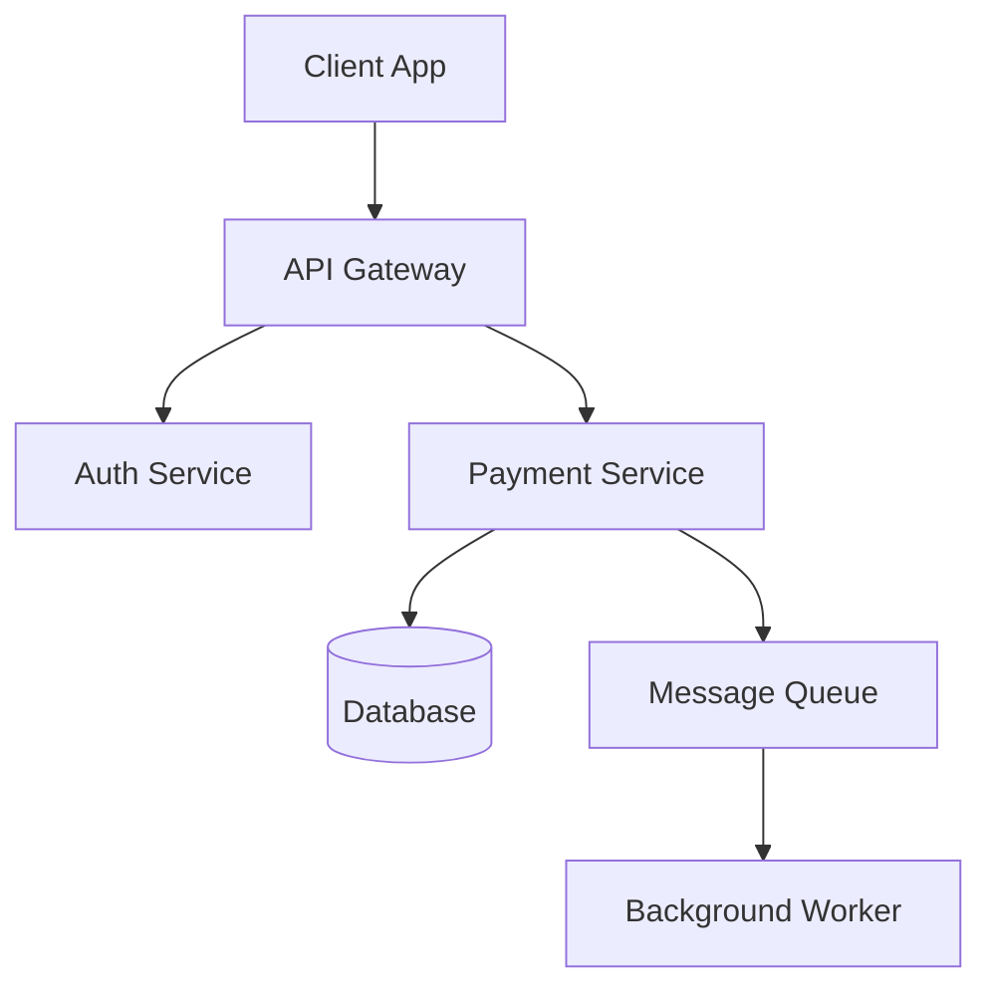
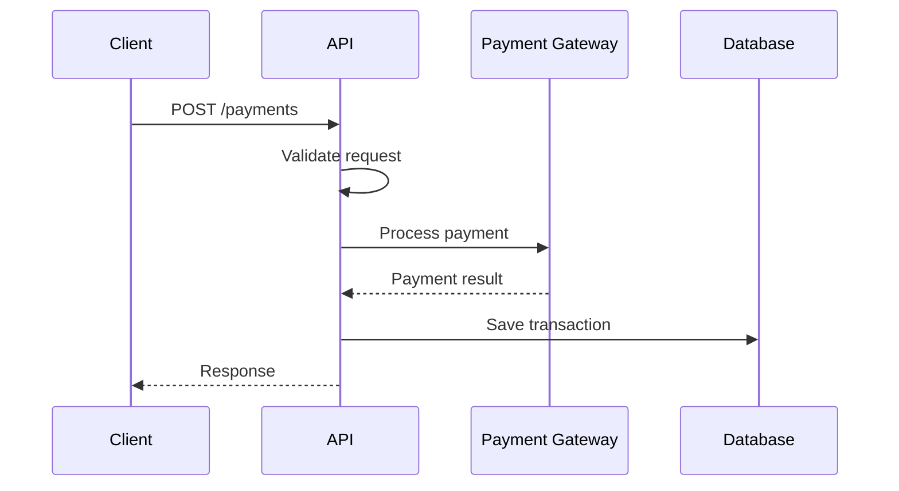
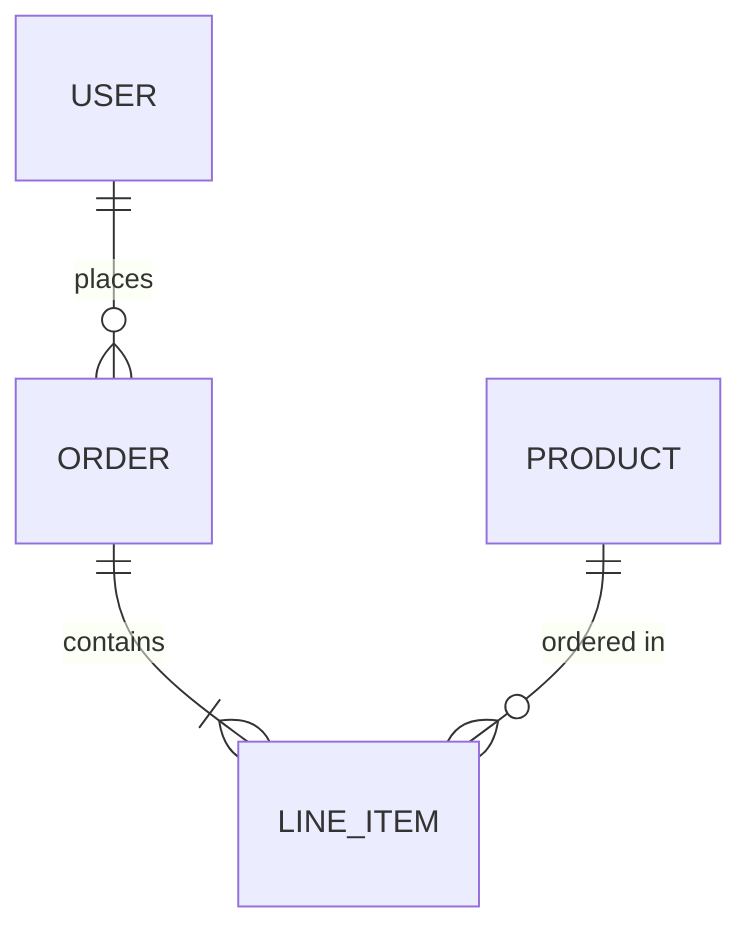

# Documentation

Comprehensive documentation skill for generating markdown, docstrings, API docs, OpenAPI specs, and architecture diagrams.

## Core Capabilities

### Markdown Documentation

Generate clear, comprehensive markdown docs:

**README Structure:**
```markdown
# Project Name

Brief description of the project.

## Features

- Feature 1
- Feature 2

## Installation

\`\`\`bash
pip install project-name
\`\`\`

## Quick Start

\`\`\`python
from project import main
main.run()
\`\`\`

## Configuration

| Variable | Description | Default |
|----------|-------------|---------|
| DEBUG    | Enable debug mode | false |

## API Reference

See [API docs](docs/api.md)

## Contributing

See [Contributing Guide](CONTRIBUTING.md)

## License

MIT
```

**Documentation files:**
- README.md - Project overview
- CONTRIBUTING.md - Contribution guidelines
- CHANGELOG.md - Version history
- docs/api.md - API reference
- docs/architecture.md - System design

### Python Docstrings

Generate comprehensive docstrings:

**Google Style (Recommended):**
```python
def process_payment(amount: float, currency: str = "USD") -> PaymentResult:
    """Process a payment transaction.

    Validates the payment amount and currency, then submits
    the transaction to the payment gateway.

    Args:
        amount: The payment amount in the specified currency.
            Must be positive.
        currency: ISO 4217 currency code. Defaults to "USD".

    Returns:
        PaymentResult containing transaction ID and status.

    Raises:
        ValueError: If amount is negative or zero.
        PaymentError: If the payment gateway rejects the transaction.

    Example:
        >>> result = process_payment(99.99, "USD")
        >>> print(result.transaction_id)
        'txn_123456'
    """
```

**NumPy Style:**
```python
def calculate_statistics(data: np.ndarray) -> dict:
    """
    Calculate descriptive statistics for the input data.

    Parameters
    ----------
    data : np.ndarray
        Input array of numerical values.

    Returns
    -------
    dict
        Dictionary containing 'mean', 'std', 'min', 'max'.

    See Also
    --------
    numpy.mean : Calculate mean value.
    numpy.std : Calculate standard deviation.

    Examples
    --------
    >>> stats = calculate_statistics(np.array([1, 2, 3, 4, 5]))
    >>> stats['mean']
    3.0
    """
```

### API Documentation

Generate API reference documentation:

**Sphinx Setup:**
```bash
# Install Sphinx
pip install sphinx sphinx-rtd-theme sphinx-autodoc-typehints

# Initialize docs
sphinx-quickstart docs

# Generate API docs
sphinx-apidoc -o docs/api src/
```

**conf.py configuration:**
```python
extensions = [
    'sphinx.ext.autodoc',
    'sphinx.ext.napoleon',
    'sphinx.ext.viewcode',
    'sphinx_autodoc_typehints',
]

html_theme = 'sphinx_rtd_theme'

autodoc_default_options = {
    'members': True,
    'member-order': 'bysource',
    'special-members': '__init__',
    'undoc-members': True,
}
```

**MkDocs Setup:**
```yaml
# mkdocs.yml
site_name: Project Documentation
theme:
  name: material

plugins:
  - search
  - mkdocstrings:
      handlers:
        python:
          options:
            show_source: true

nav:
  - Home: index.md
  - API Reference: api.md
  - Guides:
    - Getting Started: guides/quickstart.md
    - Configuration: guides/config.md
```

### OpenAPI Specifications

Generate API specifications:

**OpenAPI 3.0 Format:**
```yaml
openapi: 3.0.0
info:
  title: Payment API
  version: 1.0.0
  description: API for processing payments

servers:
  - url: https://api.example.com/v1

paths:
  /payments:
    post:
      summary: Create a payment
      operationId: createPayment
      tags:
        - Payments
      requestBody:
        required: true
        content:
          application/json:
            schema:
              $ref: '#/components/schemas/PaymentRequest'
      responses:
        '201':
          description: Payment created
          content:
            application/json:
              schema:
                $ref: '#/components/schemas/PaymentResponse'
        '400':
          description: Invalid request
          content:
            application/json:
              schema:
                $ref: '#/components/schemas/Error'

components:
  schemas:
    PaymentRequest:
      type: object
      required:
        - amount
        - currency
      properties:
        amount:
          type: number
          format: float
          minimum: 0.01
        currency:
          type: string
          pattern: '^[A-Z]{3}$'

    PaymentResponse:
      type: object
      properties:
        id:
          type: string
        status:
          type: string
          enum: [pending, completed, failed]

    Error:
      type: object
      properties:
        code:
          type: string
        message:
          type: string
```

### Architecture Diagrams

Generate Mermaid diagrams:

**System Architecture:**


**Sequence Diagram:**


**Entity Relationship:**


## Documentation Workflow

### Full Documentation Generation

1. **Scan codebase**: Identify modules and functions
2. **Generate docstrings**: Add missing documentation
3. **Create API docs**: Build Sphinx/MkDocs site
4. **Update README**: Ensure current information
5. **Generate diagrams**: Visualize architecture

### Documentation Updates

When code changes:
1. Update affected docstrings
2. Regenerate API documentation
3. Update changelog
4. Review README accuracy
5. Update diagrams if architecture changed

## Quality Standards

### Docstring Requirements

- All public functions documented
- Parameters and returns described
- Exceptions listed
- Examples for complex functions
- Type hints included

### README Requirements

- Clear project description
- Installation instructions
- Quick start example
- Configuration reference
- License information

### API Documentation Requirements

- All endpoints documented
- Request/response examples
- Error responses listed
- Authentication explained
- Rate limits noted

## Tools Integration

**Documentation generation:**
```bash
# Sphinx
cd docs && make html

# MkDocs
mkdocs build
mkdocs serve  # Local preview

# OpenAPI
# Generate from code annotations or manually maintain
```

**Docstring validation:**
```bash
# Check docstring coverage
pydocstyle src/

# Check docstring format
darglint src/
```

## Integration

Coordinate with other skills:
- **code-quality skill**: Docstring coverage
- **git-workflows skill**: Changelog updates
- **architecture-review skill**: Diagram accuracy
